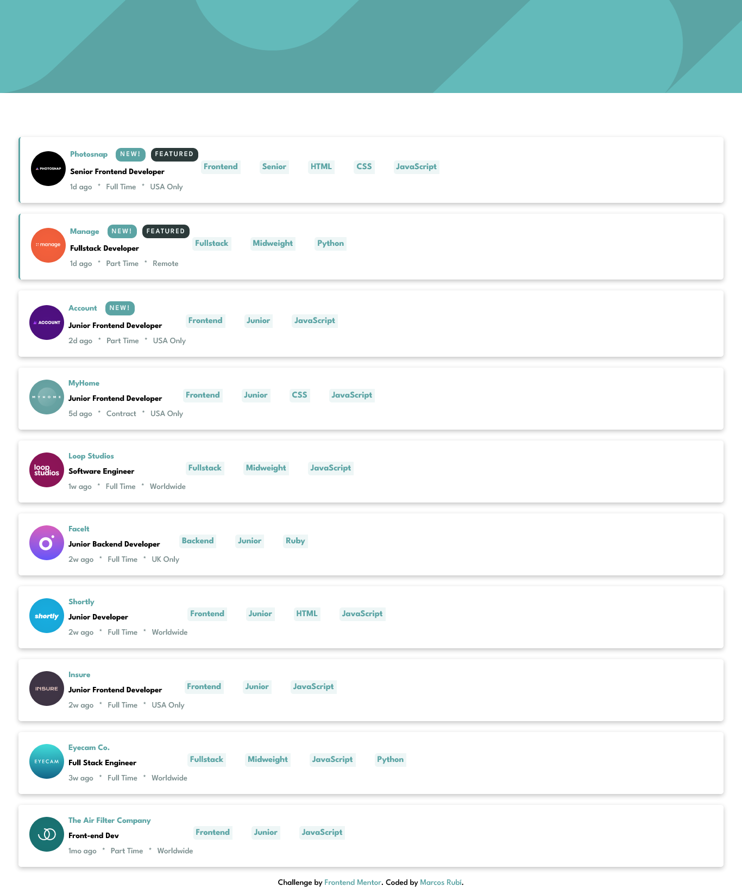

# Frontend Mentor - Job listings with filtering solution

This is a solution to the [Job listings with filtering challenge on Frontend Mentor](https://www.frontendmentor.io/challenges/job-listings-with-filtering-ivstIPCt). Frontend Mentor challenges help you improve your coding skills by building realistic projects. 

## Table of contents

- [Overview](#overview)
  - [The challenge](#the-challenge)
  - [Screenshot](#screenshot)
  - [Links](#links)
- [My process](#my-process)
  - [Built with](#built-with)
- [Author](#author)

## Overview

### The challenge

Users should be able to:

- View the optimal layout for the site depending on their device's screen size
- See hover states for all interactive elements on the page
- Filter job listings based on the categories

### Screenshot

### Links

- Solution URL: [GitHub](https://github.com/MarcosRubi/Job-listings-with-filtering)
- Live Site URL: [GitHub Pages](https://marcosrubi.github.io/Job-listings-with-filtering/)

## My process

### Built with

- Semantic HTML5 markup
- CSS custom properties
- Flexbox
- JavaScript
- Mobile-first workflow
- [React](https://es.reactjs.org/)

## Author

- Website - [Marcos Rubí](https://mrubi.vercel.app/)
- Frontend Mentor - [@MarcosRubi](https://www.frontendmentor.io/profile/MarcosRubi)

